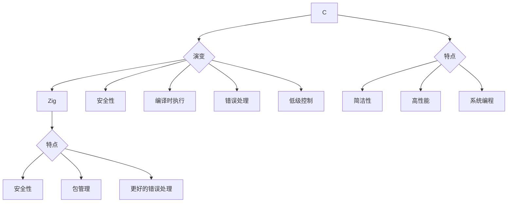

# zig-for-babies
Learning zig from scratch

# Zig 的定位、优势与 C 的比较

## Zig 的定位

Zig 是一种系统编程语言，旨在提供高效、安全和可维护的代码。它专注于简单性、灵活性和可预测性，适合用于操作系统开发、嵌入式系统以及高性能应用程序。

## Zig 的优势

1. **内存安全**：
   - Zig 设计关注内存安全，尽量减少常见的错误，如缓冲区溢出和使用未初始化的内存。
  
2. **编译时执行**：
   - Zig 允许在编译时执行代码，这使得开发者可以在编译过程中进行复杂的计算，提高灵活性。

3. **显式错误处理**：
   - Zig 提供了明确的错误处理机制，避免了异常的使用，使得错误处理更为直接和透明。

4. **更好的工具支持**：
   - Zig 内置了包管理系统，便于项目依赖管理；同时，Zig 还具备强大的跨平台支持。

5. **控制与性能**：
   - Zig 保留了对低级硬件的控制，允许开发者像 C 一样写出高性能的代码，而又不会牺牲安全性。

## 与 C 的相同点

1. **系统编程**：
   - Zig 和 C 都可以用于系统级编程，适合开发操作系统、驱动程序和嵌入式软件。

2. **性能**：
   - 两种语言都设计为高性能，编译后的代码可以生成接近机器语言的高效代码。

3. **低级控制**：
   - Zig 和 C 都允许开发者直接操作内存和硬件，提供对底层系统的控制。

## Zig 的提升点

1. **安全性提升**：
   - Zig 提供更好的内存安全保障，比 C 更少出现导致崩溃的错误。

2. **更简洁的错误处理**：
   - Zig 的错误处理机制比 C 的返回码方式更为清晰高效，提升代码的可读性。

3. **包管理支持**：
   - Zig 内置的包管理系统相比 C 的手动管理，显著提升了开发效率。

4. **编译时特性**：
   - Zig 允许在编译时执行逻辑，使得代码更具灵活性，减少运行时的错误。

5. **简化的语法**：
   - Zig 的语法设计更为现代，降低了学习曲线，使得新手开发者更容易上手。

### 结论

Zig 旨在结合 C 的高性能和低级控制优势，同时解决其在安全性和可维护性方面的不足，使其成为一种现代的系统编程语言。通过显著的安全性提升、灵活性和更好的工具支持，Zig 是希望开发高效且安全软件的开发者的一个不错选择。
